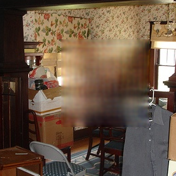

# 【搬砖】图像修复实战

## context-encoder
### 环境准备

```shell
http://torch.ch/docs/getting-started.html#_
```
因为是lua torch 写的网络，所以要安装这个环境。

感觉这个torch7的框架还是不错的。

```shell
Getting started with TorchEdit on GitHub
Installing Torch
We provide a simple installation process for Torch on Mac OS X and Ubuntu 12+:

Torch can be installed to your home folder in ~/torch by running these three commands:

# in a terminal, run the commands WITHOUT sudo
git clone https://github.com/torch/distro.git ~/torch --recursive
cd ~/torch; bash install-deps;
./install.sh
The first script installs the basic package dependencies that LuaJIT and Torch require. The second script installs LuaJIT, LuaRocks, and then uses LuaRocks (the lua package manager) to install core packages like torch, nn and paths, as well as a few other packages.

The script adds torch to your PATH variable. You just have to source it once to refresh your env variables. The installation script will detect what is your current shell and modify the path in the correct configuration file.

# On Linux with bash
source ~/.bashrc
# On Linux with zsh
source ~/.zshrc
# On OSX or in Linux with none of the above.
source ~/.profile
If you ever need to uninstall torch, simply run the command:
```

安装这个官网的链接，安装这个框架。有几个坑。

1、in a terminal, run the commands WITHOUT sudo

它说不要sudo，可是后面还是要sudo的权限的。

然后我就用管理员的账号给自己添加sudo。


首先打开管理员账号。sudo -i  输入管理员的密码，就进入有root权限的su登录。


然后修改文件权限，

```shell
chmod 777 /etc/sudoers
```
修改文件在文件root后面添加自己的权限

```
vim /etc/sudoers

# User privilege specification
root	ALL=(ALL:ALL) ALL
dengjunhui ALL=(ALL:ALL) ALL
# Members of the admin group may gain root privileges
%admin ALL=(ALL) ALL

# Allow members of group sudo to execute any command
%sudo	ALL=(ALL:ALL) ALL
```
然后修改回原来的权限。

```
chmod 440 /etc/sudoers
```

2.install.sh这一步的时候，cuda10.0以上的可能安装失败。原因应该是某些cuda的功能特性（FP16）不支持。所以现在跑cuda9的版本。

### 运行

准备数据，将voc的数据拷贝到dataset，按照目录结构建立好。

```shell
dataset
--train
----images
--val
----images
```
然后运行命令。如下：

```shell
DATA_ROOT=dataset/train display=0 display_id=0 name=inpaintRandomNoOverlap useOverlapPred=0 wtl2=0.999 nBottleneck=4000 niter=5000 loadSize=350 fineSize=128 gpu=1 th train_random.lua
```
这里将display 设置成0，如果你没有安装display模块的话。...

### 效果


还有是最后面loss降低不下来，效果略差。

## inpainting_gmcnn
### 数据准备

将voc数据放到 dataset 按照目录结构放好。
```
│   ├── dataset
│   │   ├── VOCdevkit
│   │   │   └── VOC2007
│   │   │       ├── Annotations
│   │   │       ├── ImageSets
│   │   │       ├── JPEGImages
│   │   │       ├── SegmentationClass
│   │   │       └── SegmentationObject
```

### 代码修改

我们修改了一下几个地方

```python
diff --git a/pytorch/data/data.py b/pytorch/data/data.py
index b36618e..1eec521 100644
--- a/pytorch/data/data.py
+++ b/pytorch/data/data.py
@@ -17,7 +17,8 @@ class ToTensor(object):
 
 class InpaintingDataset(Dataset):
     def __init__(self, info_list, root_dir='', im_size=(256, 256), transform=None):
-        self.filenames = open(info_list, 'rt').read().splitlines()
+        # self.filenames = open(info_list, 'rt').read().splitlines()
+        self.filenames = info_list
         self.root_dir = root_dir
         self.transform = transform
         self.im_size = im_size
@@ -43,7 +44,10 @@ class InpaintingDataset(Dataset):
         return im_scaled
 
     def __getitem__(self, idx):
-        image = self.read_image(os.path.join(self.root_dir, self.filenames[idx]))
+        # print(self.root_dir)
+        # print(self.filenames[idx])
+        # print(os.path.join(self.root_dir, self.filenames[idx]))
+        image = self.read_image( self.filenames[idx] )
         sample = {'gt': image}
         if self.transform:
             sample = self.transform(sample)
diff --git a/pytorch/options/train_options.py b/pytorch/options/train_options.py
index 1578ac9..67030d6 100644
--- a/pytorch/options/train_options.py
+++ b/pytorch/options/train_options.py
@@ -35,10 +35,10 @@ class TrainOptions:
         self.parser.add_argument('--random_seed', type=bool, default=False)
         self.parser.add_argument('--padding', type=str, default='SAME')
         self.parser.add_argument('--D_max_iters', type=int, default=5)
-        self.parser.add_argument('--lr', type=float, default=1e-5, help='learning rate for training')
+        self.parser.add_argument('--lr', type=float, default=1e-7, help='learning rate for training')
 
         self.parser.add_argument('--train_spe', type=int, default=1000)
-        self.parser.add_argument('--epochs', type=int, default=40)
+        self.parser.add_argument('--epochs', type=int, default=4000)
         self.parser.add_argument('--viz_steps', type=int, default=5)
         self.parser.add_argument('--spectral_norm', type=int, default=1)
 
diff --git a/pytorch/test.py b/pytorch/test.py
index ffbaf2f..2334b8e 100644
--- a/pytorch/test.py
+++ b/pytorch/test.py
@@ -16,7 +16,7 @@ config = TestOptions().parse()
 if os.path.isfile(config.dataset_path):
     pathfile = open(config.dataset_path, 'rt').read().splitlines()
 elif os.path.isdir(config.dataset_path):
-    pathfile = glob.glob(os.path.join(config.dataset_path, '*.png'))
+    pathfile = glob.glob(os.path.join(config.dataset_path, '*.jpg'))
 else:
     print('Invalid testing data file/folder path.')
     exit(1)
diff --git a/pytorch/train.py b/pytorch/train.py
index e44a8e9..cfe8896 100644
--- a/pytorch/train.py
+++ b/pytorch/train.py
@@ -7,11 +7,14 @@ from data.data import InpaintingDataset, ToTensor
 from model.net import InpaintingModel_GMCNN
 from options.train_options import TrainOptions
 from util.utils import getLatest
+import glob
 
 config = TrainOptions().parse()
 
 print('loading data..')
-dataset = InpaintingDataset(config.dataset_path, '', transform=transforms.Compose([
+filenames = glob.glob(config.dataset_path+"/*.jpg")
+
+dataset = InpaintingDataset(filenames, config.dataset_path, transform=transforms.Compose([
     ToTensor()
 ]))
 dataloader = DataLoader(dataset, batch_size=config.batch_size, shuffle=True, num_workers=4, drop_last=True)
```

一个是train的和test的数据输入，兼容到我们自己的数据格式。

第二个是 学习率和epochs。

### 效果





效果不是很好。loss一直降不下去，也没有去调了。


