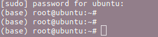
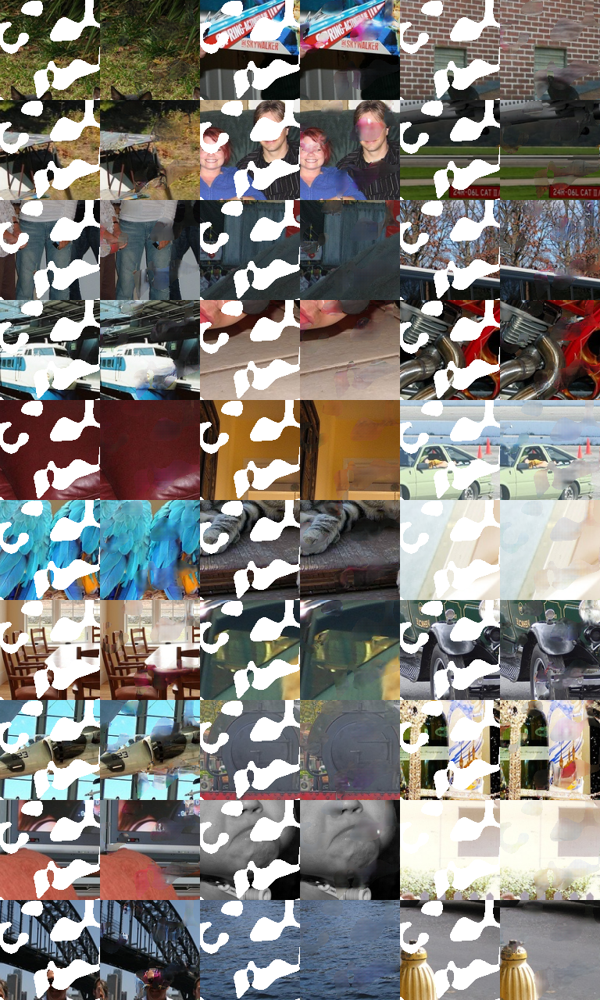

## 环境准备

```
http://torch.ch/docs/getting-started.html#_
```
因为是lua torch 写的网络，所以要安装这个环境。

感觉这个torch7的框架还是不错的。

```
Getting started with TorchEdit on GitHub
Installing Torch
We provide a simple installation process for Torch on Mac OS X and Ubuntu 12+:

Torch can be installed to your home folder in ~/torch by running these three commands:

# in a terminal, run the commands WITHOUT sudo
git clone https://github.com/torch/distro.git ~/torch --recursive
cd ~/torch; bash install-deps;
./install.sh
The first script installs the basic package dependencies that LuaJIT and Torch require. The second script installs LuaJIT, LuaRocks, and then uses LuaRocks (the lua package manager) to install core packages like torch, nn and paths, as well as a few other packages.

The script adds torch to your PATH variable. You just have to source it once to refresh your env variables. The installation script will detect what is your current shell and modify the path in the correct configuration file.

# On Linux with bash
source ~/.bashrc
# On Linux with zsh
source ~/.zshrc
# On OSX or in Linux with none of the above.
source ~/.profile
If you ever need to uninstall torch, simply run the command:
```

安装这个官网的链接，安装这个框架。有几个坑。

1、in a terminal, run the commands WITHOUT sudo

它说不要sudo，可是后面还是要sudo的权限的。

然后我就用管理员的账号给自己添加sudo。


首先打开管理员账号。sudo -i  输入管理员的密码，就进入有root权限的su登录。



然后修改文件权限，

```shell
chmod 777 /etc/sudoers
```
修改文件在文件root后面添加自己的权限

```
vim /etc/sudoers

# User privilege specification
root	ALL=(ALL:ALL) ALL
dengjunhui ALL=(ALL:ALL) ALL
# Members of the admin group may gain root privileges
%admin ALL=(ALL) ALL

# Allow members of group sudo to execute any command
%sudo	ALL=(ALL:ALL) ALL
```
然后修改回原来的权限。

```
chmod 440 /etc/sudoers
```

2.install.sh这一步的时候，cuda10.0以上的可能安装失败。原因应该是某些cuda的功能特性（FP16）不支持。所以现在跑cuda9的版本。

## 运行

准备数据，将voc的数据拷贝到dataset，按照目录结构建立好。

```
dataset
--train
----images
--val
----images
```
然后运行命令。如下：

```
DATA_ROOT=dataset/train display=0 display_id=0 name=inpaintRandomNoOverlap useOverlapPred=0 wtl2=0.999 nBottleneck=4000 niter=5000 loadSize=350 fineSize=128 gpu=1 th train_random.lua
```
这里将display 设置成0，如果你没有安装display模块的话。...

## 效果




还有是最后面loss降低不下来，效果略差。


