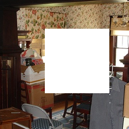
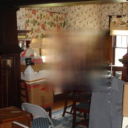
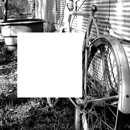

## 数据准备

将voc数据放到 dataset 按照目录结构放好。
```
│   ├── dataset
│   │   ├── VOCdevkit
│   │   │   └── VOC2007
│   │   │       ├── Annotations
│   │   │       ├── ImageSets
│   │   │       ├── JPEGImages
│   │   │       ├── SegmentationClass
│   │   │       └── SegmentationObject
```

## 代码修改

我们修改了一下几个地方

```python
diff --git a/pytorch/data/data.py b/pytorch/data/data.py
index b36618e..1eec521 100644
--- a/pytorch/data/data.py
+++ b/pytorch/data/data.py
@@ -17,7 +17,8 @@ class ToTensor(object):
 
 class InpaintingDataset(Dataset):
     def __init__(self, info_list, root_dir='', im_size=(256, 256), transform=None):
-        self.filenames = open(info_list, 'rt').read().splitlines()
+        # self.filenames = open(info_list, 'rt').read().splitlines()
+        self.filenames = info_list
         self.root_dir = root_dir
         self.transform = transform
         self.im_size = im_size
@@ -43,7 +44,10 @@ class InpaintingDataset(Dataset):
         return im_scaled
 
     def __getitem__(self, idx):
-        image = self.read_image(os.path.join(self.root_dir, self.filenames[idx]))
+        # print(self.root_dir)
+        # print(self.filenames[idx])
+        # print(os.path.join(self.root_dir, self.filenames[idx]))
+        image = self.read_image( self.filenames[idx] )
         sample = {'gt': image}
         if self.transform:
             sample = self.transform(sample)
diff --git a/pytorch/options/train_options.py b/pytorch/options/train_options.py
index 1578ac9..67030d6 100644
--- a/pytorch/options/train_options.py
+++ b/pytorch/options/train_options.py
@@ -35,10 +35,10 @@ class TrainOptions:
         self.parser.add_argument('--random_seed', type=bool, default=False)
         self.parser.add_argument('--padding', type=str, default='SAME')
         self.parser.add_argument('--D_max_iters', type=int, default=5)
-        self.parser.add_argument('--lr', type=float, default=1e-5, help='learning rate for training')
+        self.parser.add_argument('--lr', type=float, default=1e-7, help='learning rate for training')
 
         self.parser.add_argument('--train_spe', type=int, default=1000)
-        self.parser.add_argument('--epochs', type=int, default=40)
+        self.parser.add_argument('--epochs', type=int, default=4000)
         self.parser.add_argument('--viz_steps', type=int, default=5)
         self.parser.add_argument('--spectral_norm', type=int, default=1)
 
diff --git a/pytorch/test.py b/pytorch/test.py
index ffbaf2f..2334b8e 100644
--- a/pytorch/test.py
+++ b/pytorch/test.py
@@ -16,7 +16,7 @@ config = TestOptions().parse()
 if os.path.isfile(config.dataset_path):
     pathfile = open(config.dataset_path, 'rt').read().splitlines()
 elif os.path.isdir(config.dataset_path):
-    pathfile = glob.glob(os.path.join(config.dataset_path, '*.png'))
+    pathfile = glob.glob(os.path.join(config.dataset_path, '*.jpg'))
 else:
     print('Invalid testing data file/folder path.')
     exit(1)
diff --git a/pytorch/train.py b/pytorch/train.py
index e44a8e9..cfe8896 100644
--- a/pytorch/train.py
+++ b/pytorch/train.py
@@ -7,11 +7,14 @@ from data.data import InpaintingDataset, ToTensor
 from model.net import InpaintingModel_GMCNN
 from options.train_options import TrainOptions
 from util.utils import getLatest
+import glob
 
 config = TrainOptions().parse()
 
 print('loading data..')
-dataset = InpaintingDataset(config.dataset_path, '', transform=transforms.Compose([
+filenames = glob.glob(config.dataset_path+"/*.jpg")
+
+dataset = InpaintingDataset(filenames, config.dataset_path, transform=transforms.Compose([
     ToTensor()
 ]))
 dataloader = DataLoader(dataset, batch_size=config.batch_size, shuffle=True, num_workers=4, drop_last=True)
```

一个是train的和test的数据输入，兼容到我们自己的数据格式。

第二个是 学习率和epochs。

## 效果







效果不是很好。loss一直降不下去，也没有去调了。
